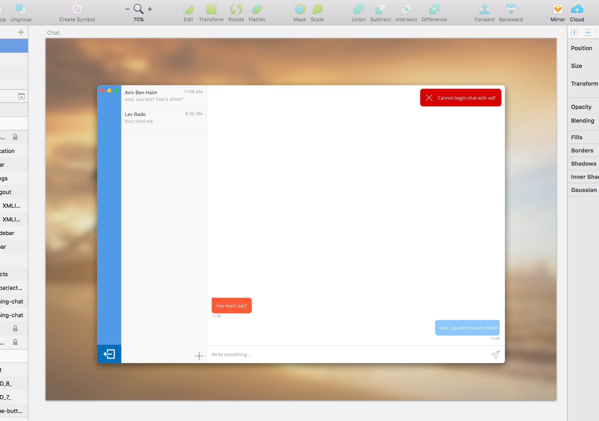
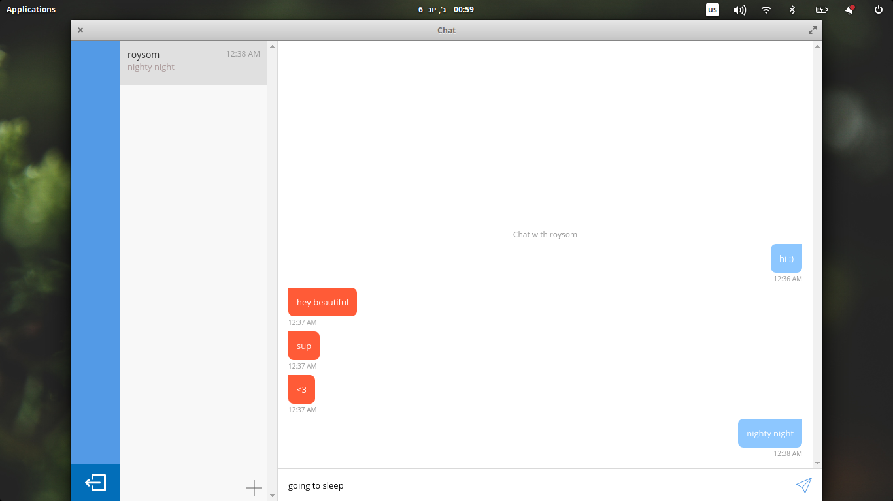
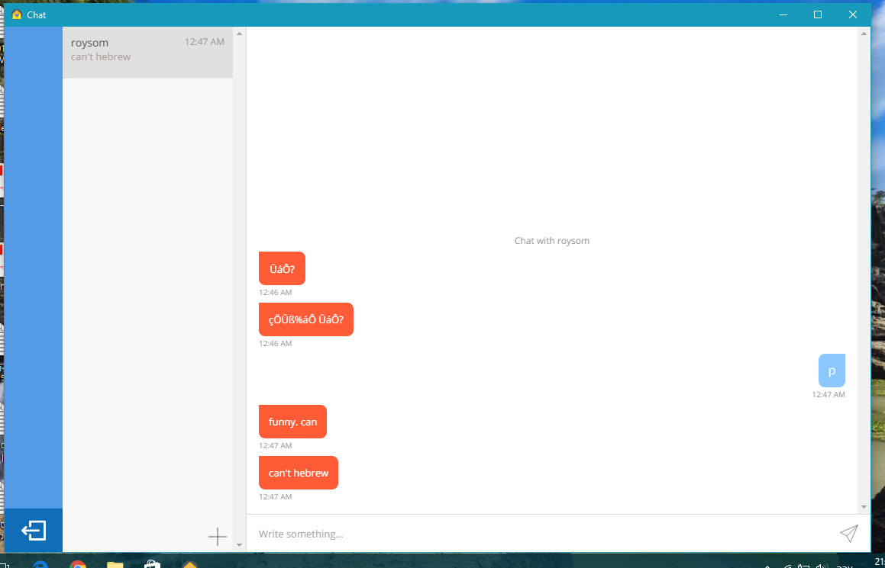

# Woosh Client
Part of an open source, secured chat project for university

### Abstract

Woosh is a secured e2e chat implementation, carried using a system of server-client network. It was developed as part of my final project for my B.Sc of Computer Science in Ben Gurion University of the Negev, as a demonstration of computer and network security principals.

Woosh comes to provide a secured solution for the carrying of private conversations on the application level. It takes inspiration from "trusted provider" encryption algorithms, such as Telegram's **MTProto** or Signal's (and WhatsApp's) **Signal** protocols - where communication is not p2p, but the distribution of keys and routing of messages is being done through a trusted central server. If the "trustfulness" invariant is being kept, said server is not able to read contents from any of the messages, as they're entirely encrypted on the clients' side.

### Assumptions and constraints

As this is an academic demonstration, Woosh does not provide commercial-grade protection, and works under the following assumptions and constraints:

1. It provides security only on the Application level of the network; meaning that, in order to provide full protection and privacy of the communication itself, one must run the communication behind TLS protection (`https`).

2. It assumes that the server is to be trusted with the distribution of keys and routing of messages. Therefore, a compromised or malicious server can carry out MITM attacks, by replacing public keys of users with the attacker's own. HMAC protection is provided, though only for private data that's stored on the server, such as private keys and the contents of messages.

3. Despite the above, user information is being cached locally on the client's end as long as they do not log out, and therefore, even in the case of an attack, previous conversations (and any consequent messages sent between two logged in and previously engaged users) remain private, much like it does with WhatsApp or Telegram. This is due to the recipients' public keys being already present on the client's side.

4. In case of data theft from the server, the attacker will not be able to read any of the messages or private data that is stored in it, due to it being encrypted using keys only known to the users themselves.

5. Sensitive data is being encrypted using symmetric keys, prior to being sent to the server **or** stored locally, and therefore cannot be obtained **but** only by knowing the user's own password.

### How it works

This article refers to the implementation of the **client** application. For the server's, refer to the documentation in the [Woosh Server Repository](https://github.com/illBeRoy/secured-chat-server).

The Woosh client application stack was carefully chosen in order to provide easy and standard implementations to network communication, lightweight cryptography and accessible environment for displaying user interface.

In order to achieve the above, I have decided to go with Github's [Electron](https://github.com/electron/electron), a cross-platform runtime that packs together **nodejs** and **chromium** under the hood.

The language of choice, of course, was Javascript, in its [es2017](https://tc39.github.io/ecma262/) version. In order to perserve compatability, [babel](https://babeljs.io/) is used to transpile the code into **es5** (standard js).

**Networking**

Networking is being managed with the server using restful-like api endpoints. Due to time constraints and other commitments, real time bi-directional communication is not supported, and so synchronization is being carried out using **polling** on the client's end. I've used [axios](https://github.com/mzabriskie/axios) in order to perform requests, as it has an elegant, promise-based (async) interface.

**Cryptography**

Two encryption methods are used within the application, one being symmetric AES encryption (CBC, 128-bit), and the other is asymmetrical RSA encryption (4096-bit).

Three keys are derived from the user's password, which are used for the following:

1. Private data encryption: the first key is used for encrypting sensitive data, such as the user's own asymm private key.

2. Authentication: another deriviation is used as the **de-facto** password against the server. Woosh does not support session-based token authentication, and so a deriviation of the user's own password is attached to every request. That's why working behind TLS is encouraged.

3. Integrity check: the last key is used for generating HMACs for the data that's saved on the server.

In addition to those, all users have pairs of RSA keys. Those are used for message transportation, and are stored on the server: the private key is encrypted using the aforementioned private data encryption key, and the public key is stored in plain text. When user A (say, Alice) wants to send a message to user B (say, Bob), the following protocol takes place:

1. Alice authenticates against the server using her own authentication key, and requests Bob's public key.

2. Alice generates a one time 128-bit AES key.

3. She constructs the payload from the following:
	* hashed mac signed with her own private key
	* the message itself, encrypted with the generated one-time key
	* the key itself, encrypted using Bob's public key

4. The message is sent to the server, where it sits, waiting for Bob to claim it.

5. Bob claims the message. He sees that Alice has sent it, and, in case he doesn't already have it, requests Alice's public key from the server.

6. Bob then uses his own private key to decrypt the one time AES key. He then uses that and fetches the actual message. When he has that, he hashes the message and verifies Alice's signature using her public key.

**User Interface**

The UI is displayed using chromium runtime, meaning that it's essentially html. It was written using Facebook's [reactjs](https://facebook.github.io/react) library.

### Development Process

**API client and Cryptography**

The first thing I've done was to write an API client that should work with my (previously implemented) server. The API client is general-purpose, and beside of knowing the structure of requests\responses and the authentication pattern, it has no knowledge of the essence of the requests that it's carrying.

Then, I've implemented the cryptography utility, with a simple interface to allow symmetric and asymmterical key generation, encryption and decryption, hashing, password derivation and cryptographic random sequence generation. As with the API client, the Crypto utility is agnostic to the context of its actions. The aforementioned message encryption and decryption protocol was implemented on this level as well.

**Models, Actions and Persistence**

The next step was to create the actual business logic. In order to achieve a sophisticated, yet easy to maintain environment, I've come up with a models\actions system, that makes use of the Design By Composition pattern:

* The Models: an orm-like layer that allowed me to define model classes and fields, and perform queries and reduces over them.

* The Actions: a declerative interface to create functions that work over model instances and classes. The actions are aware of models, but not the other way around.

* The Store: an entity that would orchestrate all models and actions, and provide data persistency, as well as fusing the models with their respective actions, creating fully fledged OO entities.

After creating the above, the client was essentially ready - besides the fact that it had no user interface.

**Testing**

In order to quickly build tests, and ensure my client's sanity, I've created a suite of integration tests that instantiate an actual server and test the client (or multiple instances of it) against it.

The suite was written using mocha and chai.

**Designing the UI**

Before implementing the UI, I've designed it using [Sketch](https://www.sketchapp.com). I've designed most of the flow, as well as each component's various states:

**Incorporating Electron**

Up until now, my client has been running over pure nodejs. When I've come to implement the UI, tho, I've had to start using Electron runtime.

In order to control its multiple-window environment, I've created a stack router that can easily switch between windows. The router itself would operate from within the main process, while the windows would each run on their own "renderer processes" - with an interface to remotely invoke the router.

**Reactjs: From design to UI**

The last thing to do was to implement the UI itself. Each of the "pages" in the aforementioned router was actually its own html page, where a standalone reactjs app would start running. There are four of these:

1. The login screen
2. The registration screen
3. The session resuming screen (re-enter password)
4. The chat screen

**Distribution**

In order to distribute the application as standalone binaries, I've used [electron-builder](https://github.com/electron-userland/electron-builder). electron-builder allowed me to pack my software as either window's **exe**, mac **dmg** and linux **deb**. In order to pack it for linux and windows, I've had to install multiple dependencies, such as mono and wine.

The final step was to test my application over various platforms. On mac it works as expected, as it is my development machine of choice:

On Linux (ElementaryOS, an Ubuntu distro):

And on Windows 10:

### Running and Packaging

**NPM tasks**

In order to fully use the source code, basic knowledge of [npm](https://www.npmjs.org) is required.

The following npm tasks are available:

* `clean` - cleans the compiled code directory
* `compile` - compiles source code into es5
* `start` - starts the application from the compiled source code
* `test` - runs integration tests (requires the server to be at a relative path)
* `server-fixtures` - instantiate a client and installs fixtures on a running server
* `pack` - creates a runtime package, but does not create a binary
* `dist` - creates a macos application binary
* `dist:all` - creates application binaries for all systems

**conf.json**

In the root directory of the project, there exists a file called `conf.json`. this file contains environmental information for the application to use:

1. The server's url (either IP or domain, including http\s prefix)
2. The directory in which to save persistent data (default is null, in which case **woosh** would save its data in the default application directory on each os)

**Running the project locally**

Given that you have a running server, and that `conf.json` is properly configured, simply compile using:

* `$ npm run clean && npm run compile`

And then run using:

* `$ npm run start`

**Packaging**

In order to create binaries, run:

* `$ npm run dist`

If you want to create binaries for all platforms, make sure that you have [all required dependencies](https://github.com/electron-userland/electron-builder/wiki/Multi-Platform-Build), and then run:

* `$ npm run dist:all`

### Attributions

The project is the work of Roy Sommer - but not solely: behind the scenes it uses many open source packages, thanks to the huge community standing behind nodejs and npm. From Facebook's reactjs to Github's Electron, axios, node-forge, babel and many more - I owe a huge thanks to the open source community. A full list of open source project could be found in my project's `package.json`.

Another important attribution should be given to [flaticon.com](flaticon.com), a huge database of vector icons to be used with apps and websites. All icons used in Woosh were either directly taken from there, or built using art from there.
